# 电商后台管理系统（vue_shop）

## vue 实战项目
## 框架
### [Vue](https://staging-cn.vuejs.org/) [Element-ui](https://element.eleme.io/#/) [Vue-cli](https://cli.vuejs.org/zh/guide/)

## 推荐 IDE Setup

- [VS Code](https://code.visualstudio.com/)

## 目录
- notes  项目笔记及接口文档
- vue_api_server 项目后端服务
- src
  - assets 静态资源
  - components 页面
    - goods 商品管理
    - order 订单管理
    - power 权限管理
    - report  数据统计
    - user 用户管理
  - router 路由
  


## 项目展示

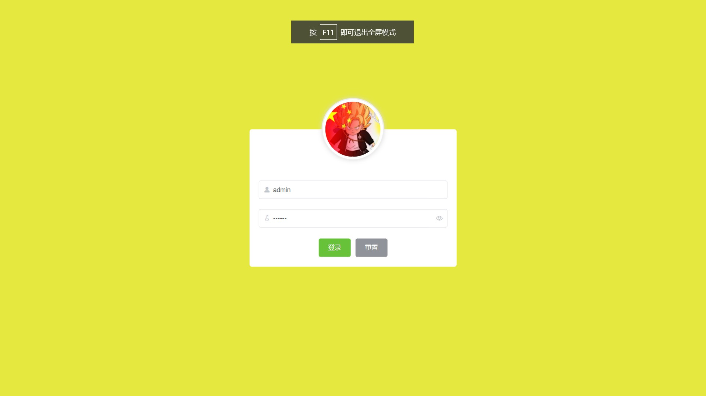


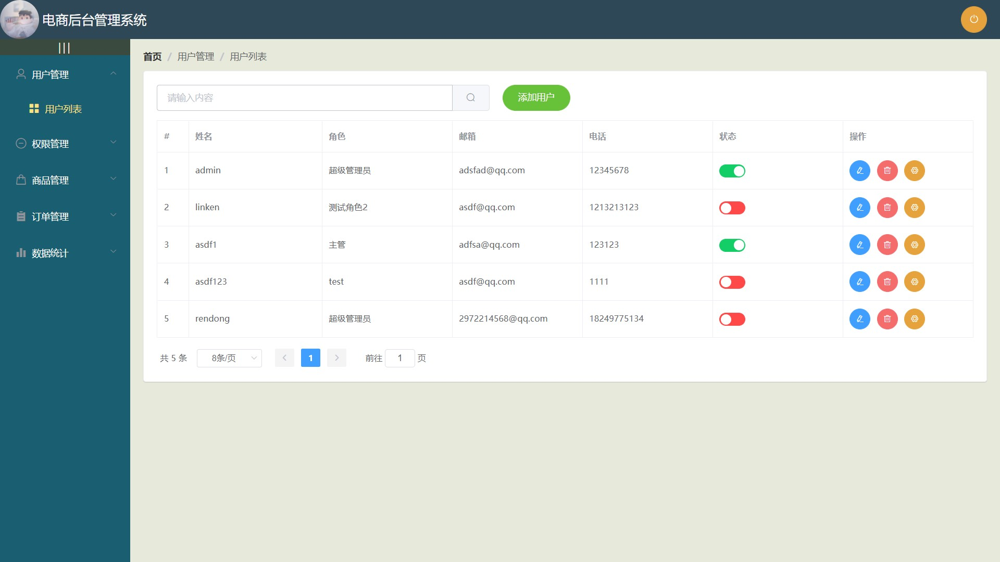

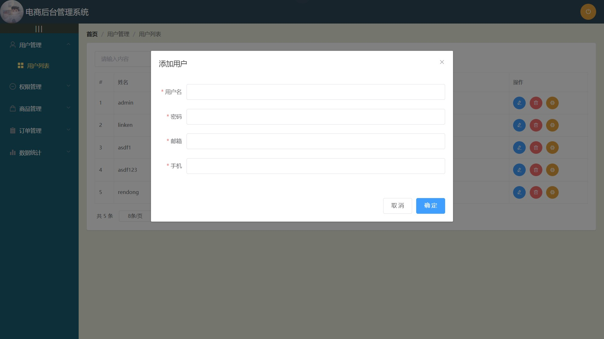

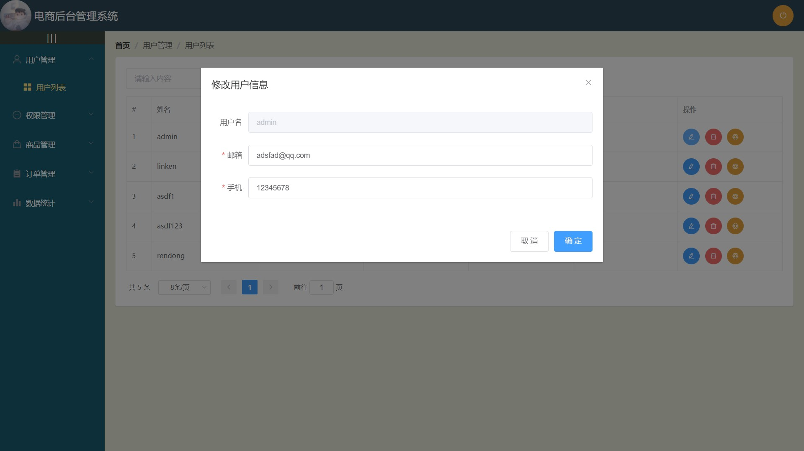

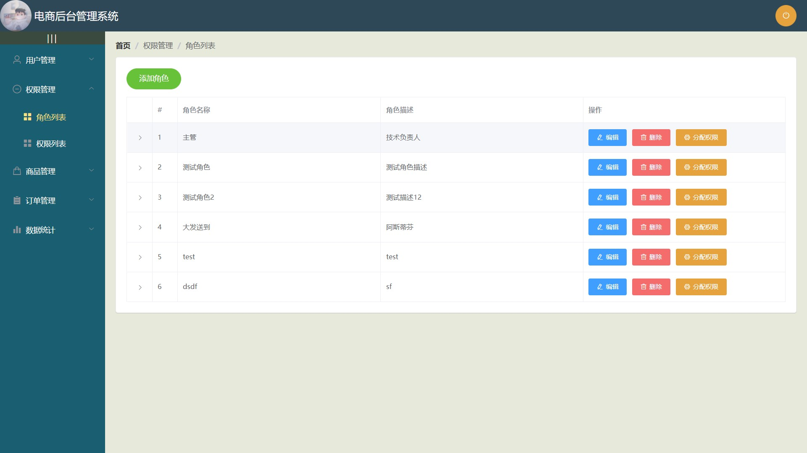

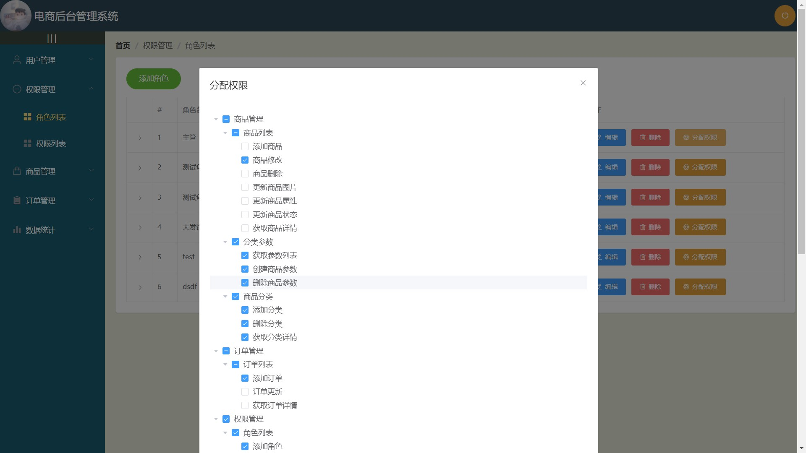

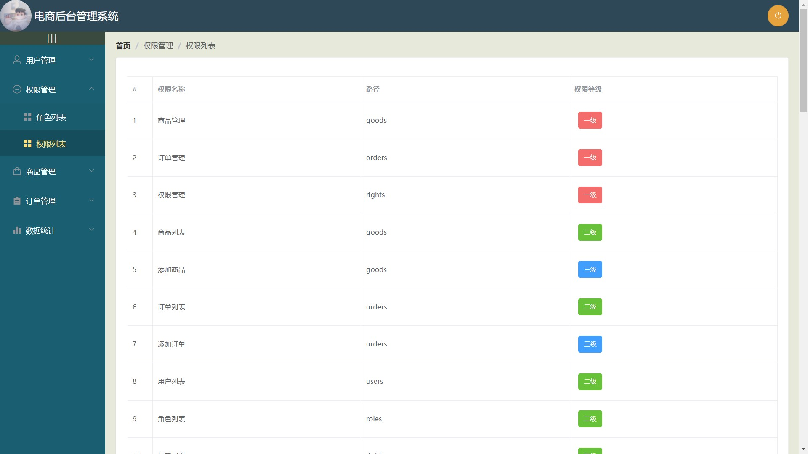

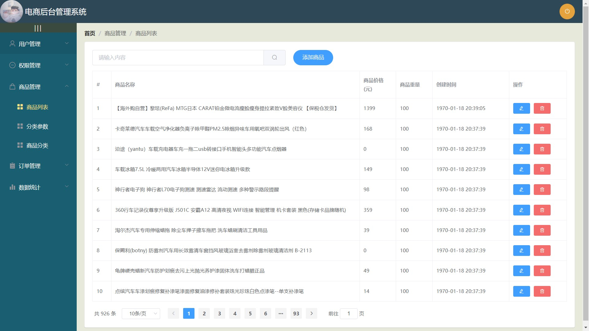

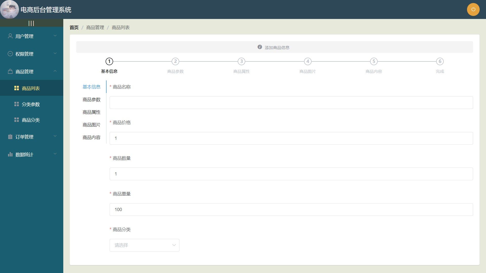

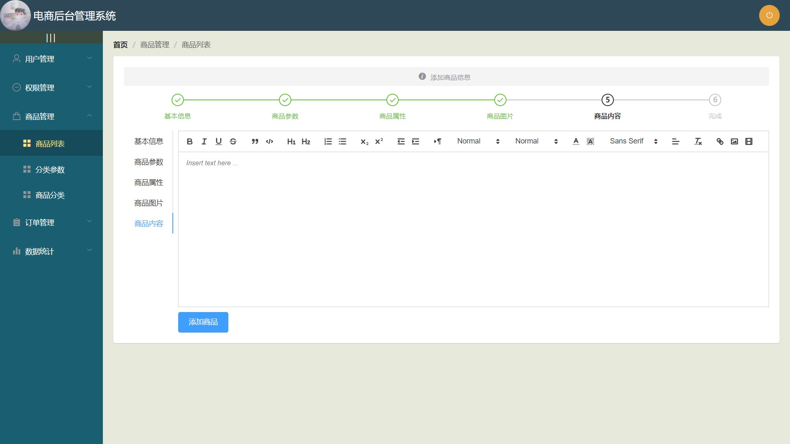


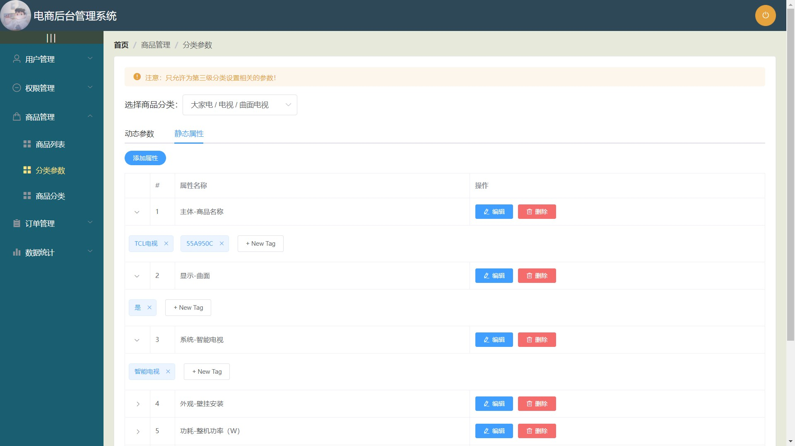

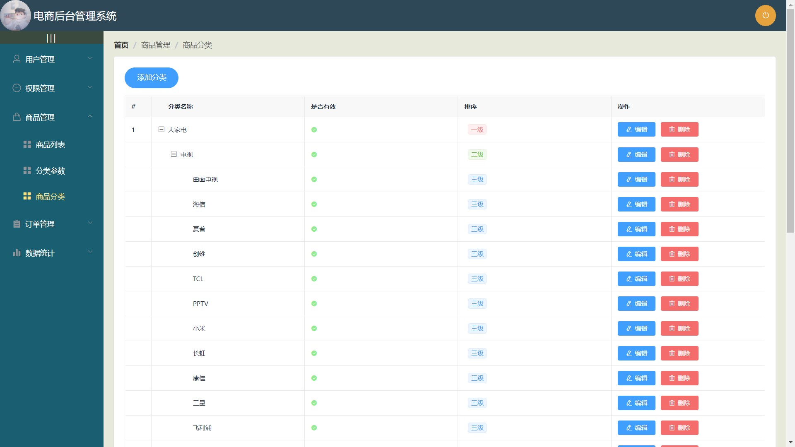

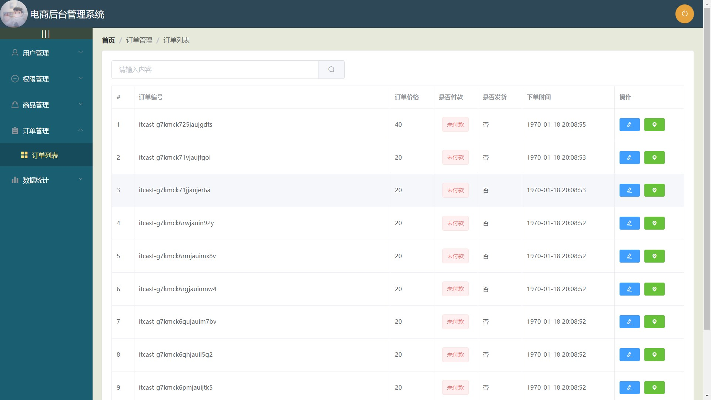

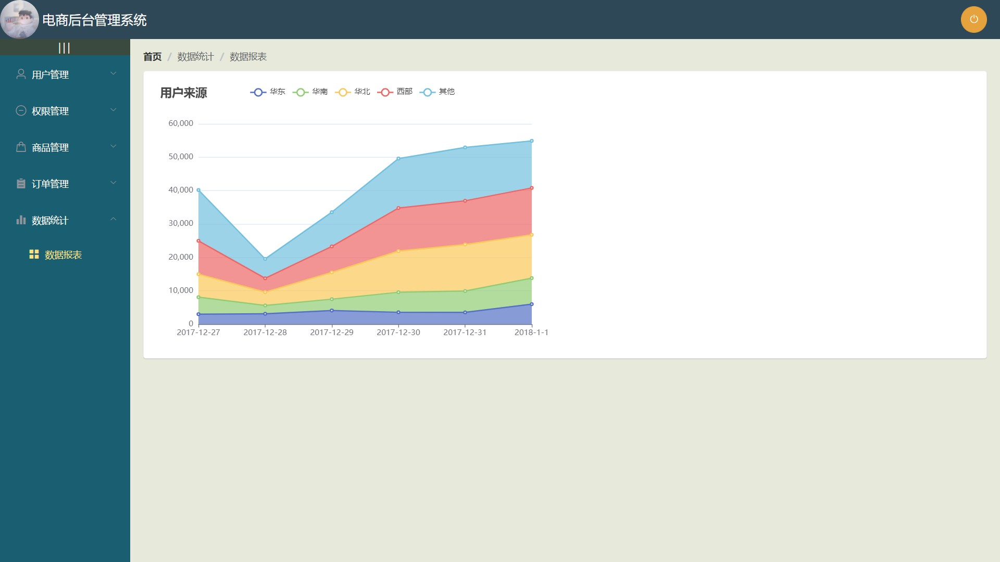


## Project setup

```
npm install
```

### Compiles and hot-reloads for development

```
npm run serve
```

### Compiles and minifies for production

```
npm run build
```

